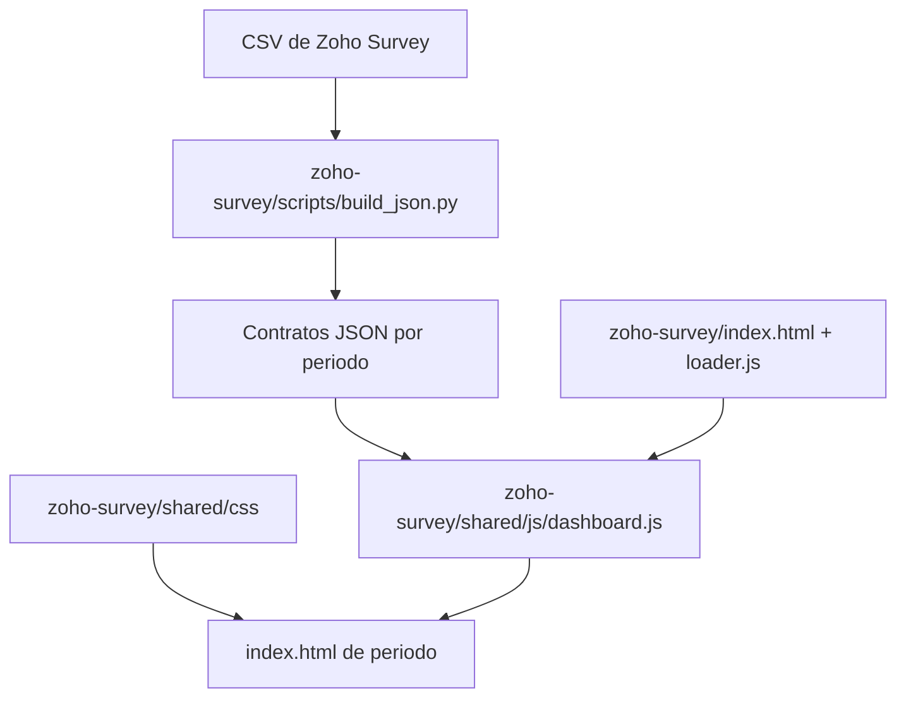

# Arquitectura Del Sistema De Encuestas De Satisfaccion

Este documento es la fuente canonica para entender la estructura tecnica de `survey-storytelling`. Los contratos de datos viven en `CONTRACTS.md`; las reglas para agentes viven en `AGENTS.md`.

## Mapa De Componentes



## Estructura De Directorios

El repositorio se organiza según el siguiente esquema de componentes y directorios clave:

```text
survey-storytelling/
├── .github/workflows/       # Workflows de CI/CD (build_students.yml, deploy-legacy.yml, validate-survey-json.yml).
├── data/                    # CSVs fuente exportados desde Zoho Survey.
├── docs/                    # Documentación y guías del proyecto.
├── tests/                   # Mini-framework de pruebas unitarias en navegador.
├── zoho-survey/             # Aplicación estática principal.
│   ├── index.html           # Loader publicado en GitHub Pages.
│   ├── underconstruction.html # Página de mantenimiento.
│   ├── shared/              # Recursos compartidos (CSS, JS, imágenes).
│   │   ├── css/             # Capas CSS (tokens, reset, layout, components).
│   │   └── js/              # Módulos JS IIFE expuestos en window.Survey*.
│   ├── template/            # Plantilla HTML para nuevos periodos de encuesta.
│   ├── scripts/             # ETL en Python, validación de esquemas y schemas JSON.
│   │   └── lib/             # Módulos ETL modularizados (config, metrics, nlp, io_helper).
│   └── students/            # Dashboards y JSONs generados por nivel y periodo.
├── AGENTS.md                # Reglas y principios operativos para IA.
├── ARCHITECTURE.md          # Arquitectura técnica global (este documento).
└── CONTRACTS.md             # Contratos CSV/JSON e invariantes de datos.
```

Para mayor detalle de responsabilidades:

| Ruta | Responsabilidad |
| --- | --- |
| `data/` | CSVs fuente exportados desde Zoho Survey. |
| `zoho-survey/scripts/` | Scripts ETL, validación de contratos y schemas de datos. |
| `zoho-survey/scripts/lib/` | Biblioteca de utilidades modularizadas del ETL (métricas, NLP, config, I/O). |
| `zoho-survey/shared/js/` | Módulos compartidos del loader y dashboard (IIFE). |
| `zoho-survey/shared/css/` | Capas CSS modulares e imports del dashboard. |
| `zoho-survey/template/` | Template base HTML para la generación automática de periodos. |
| `zoho-survey/students/` | Dashboards y datos JSON generados de estudiantes. |
| `tests/` | Infraestructura y tests unitarios de navegador. |
| `.github/workflows/` | Automatización de build, validación y deploy en GitHub Pages. |

## Pipeline De Datos

`zoho-survey/scripts/build_json.py` transforma CSVs en contratos JSON estaticos.
Para organizar el procesamiento, delega en los siguientes submódulos en `scripts/lib/`:
- `lib/config.py`: Mapeos de columnas, diccionarios de tópicos y catálogos de negocio.
- `lib/metrics.py`: Funciones puras de cálculo de NPS y CSAT.
- `lib/nlp.py`: Clasificación semántica de comentarios abiertos.
- `lib/io_helper.py`: I/O seguro con encodings alternativos y formateo de fechas.

Responsabilidades:

- Normalizar columnas de Zoho Survey a nombres internos definidos en el ETL.
- Calcular agregados NPS, CSAT y empleabilidad cuando corresponde.
- Generar datos por facultad, carrera, ciclo y dimension.
- Extraer topicos de comentarios NPS usando reglas deterministicas.
- Copiar el template del periodo y actualizar `periodos.json`.
- Mantener idempotencia: correr el script dos veces con la misma entrada debe producir el mismo resultado.

Los esquemas, archivos requeridos e invariantes estan definidos en `CONTRACTS.md`.

## Frontend

La aplicacion es una SPA estatica en Vanilla JS, sin backend ni dependencias runtime.

### Loader

- `zoho-survey/index.html`: entrada publicada en GitHub Pages.
- `zoho-survey/shared/js/loader.js`: detecta tipos de encuesta, niveles y periodos disponibles via `periodos.json`.
- Carga cada dashboard de periodo en iframe.

### Dashboard

- `zoho-survey/template/index.html`: estructura HTML base de cada periodo.
- `zoho-survey/shared/js/dashboard.js`: orquestador principal.
- `zoho-survey/shared/js/config/constants.js`: metas, ciclos y constantes compartidas.
- `zoho-survey/shared/js/utils/formatters.js`: funciones de formateo.
- `zoho-survey/shared/js/utils/sanitizer.js`: `escapeHTML` y `sanitizeHTML`.
- `zoho-survey/shared/js/utils/dom-helpers.js`: utilidades DOM compartidas.
- `zoho-survey/shared/js/components/`:
  - `tooltip.js`: Globos interactivos flotantes.
  - `progress-bar.js`: Barra superior de scroll de página.
  - `custom-select.js`: Selectores desplegables personalizados.
  - `multiselect.js`: Listas de selección múltiple móvil.
  - `filter-controller.js`: Coordinación de filtros en cascada (Facultad/Carrera/Ciclo).
  - `radar-chart.js`: Gráfico radar dinámico en SVG.
  - `sentiment-view.js`: Renders cualitativos y comentarios NPS.

Los modulos usan IIFE y exponen APIs globales `window.Survey*`. No usan ES Modules.

## CSS

`zoho-survey/shared/css/` contiene:

- `tokens.css`: design tokens y variables CSS.
- `reset.css`: reset y utilidades base.
- `layout.css`: header, navegacion, grid y footer.
- `components.css`: KPIs, filtros, barras, tooltips y tablas.
- `sections.css`: secciones, responsive y ajustes visuales.
- `dashboard.css`: entry point con `@import` para la capa dashboard.
- `loader.css`: estilos especificos del navegador de encuestas.

## Patrones Arquitectonicos

- Datos precomputados: el frontend consume JSON, no recalcula agregados que pertenecen al ETL.
- Separacion de datos y vista: los JSON no deben depender del layout visual.
- Delegacion progresiva: `dashboard.js` delega en modulos compartidos cuando existen.
- Compatibilidad backward: los contratos legacy se conservan cuando todavia hay consumidores.
- Degradacion controlada: errores de carga JSON deben tratarse sin romper toda la pagina.

## Seguridad

- Cualquier contenido externo usado en HTML debe pasar por `escapeHTML()` o `sanitizeHTML()`.
- `sanitizeHTML()` permite solo una lista reducida de etiquetas necesarias para tooltips y textos enriquecidos.
- No introducir dependencias runtime para sanitizacion sin justificar el costo operacional.

## Deuda Tecnica Vigente

- La logica de ciclos esta externalizada en `SURVEY_CONFIG`, pero todavia no es dinamica por periodo.
- `nps_carrera.json` y `csat_carrera.json` son legacy; el frontend usa las versiones `_ciclo_carrera`.
- `posgraduate/` existe como placeholder sin datos procesados.
- El template `zoho-survey/template/index.html` no tiene version de contrato propia.

## Convenciones

- JavaScript: camelCase para variables y funciones; APIs compartidas bajo `window.Survey*`.
- CSS: kebab-case para clases e IDs; usar tokens antes que valores hardcodeados.
- Python: snake_case para funciones y variables; constantes en UPPER_SNAKE_CASE.
- Compatibilidad: GitHub Pages, navegadores modernos y Python para ETL.
