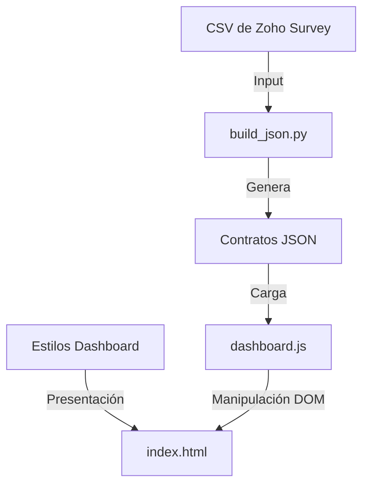

# Arquitectura del Sistema de Encuestas de Satisfacción (AI-First)

Este documento describe la arquitectura técnica del sistema de visualización de encuestas. Está diseñado para ser interpretado de forma determinista por agentes de IA y desarrolladores humanos.

## 1. Mapa de Componentes y Dependencias



### 1.1 Directorios Clave

- `zoho-survey/shared/`: Lógica y estilos reutilizables entre todas las encuestas.
- `zoho-survey/students/`: Datos y scripts específicos para encuestas estudiantiles.
- `zoho-survey/students/undergraduate/{periodo}/`: Implementación de una instancia específica de encuesta.

## 2. Pipeline de Datos (ETL)

El proceso de transformación es gestionado por `zoho-survey/scripts/build_json.py`.

### Responsabilidades Técnicas:

- **Normalización**: Renombrado de columnas de Zoho Survey a nombres internos estandarizados (ver `COLUMN_RENAME` en el script).
- **Agregación**: Cálculo de NPS (Net Promoter Score) y CSAT (Customer Satisfaction Score) por carrera, facultad y ciclo.
- **Análisis Semántico**: Extracción de tópicos basada en palabras clave para comentarios NPS (detractores y pasivos).
- **Idempotencia**: El script procesa los CSV en `data/` y genera archivos JSON en la carpeta del periodo correspondiente sin efectos secundarios acumulativos.

## 3. Capa de Visualización (Frontend)

El frontend es una aplicación de una sola página (SPA) estática diseñada para alto rendimiento.

### 3.1 `dashboard.js` (Lógica Central)

- **Estado**: Gestionado a través de un objeto `cache` para evitar re-peticiones de red.
- **Filtrado**: Lógica de filtrado multidimensional (Facultad -> Carrera -> Ciclo) implementada en `filtrarDatos()`.
- **Renderizado**: Manipulación directa del DOM basada en eventos de cambio en los selectores.
- **Dependencias Externas**: Ninguna (Vanilla JS), excepto Chart.js (si se añade) o SVGs inline para gráficos de radar.

### 3.2 `dashboard.css` (Diseño)

- Basado en variables CSS para facilitar cambios de tema.
- Layout responsivo utilizando Flexbox y CSS Grid.

## 4. Patrones Arquitectónicos Identificados

- **Separación de Datos y Vista**: Los datos residen exclusivamente en archivos JSON; el JavaScript solo consume estos contratos.
- **Delegación de Eventos**: El sistema de filtrado utiliza listeners en los elementos raíz para optimizar el rendimiento.
- **Registry de DOM**: Referencias centralizadas a elementos del DOM en el objeto `DOM` para evitar búsquedas repetitivas (`document.getElementById`).

## 5. Deuda Técnica y Fragilidad (Advertencia para IA)

- **Acoplamiento de Columnas**: El script ETL depende de que los nombres de las columnas en el CSV de Zoho Survey sean idénticos a los definidos en `COLUMN_RENAME`. Cualquier cambio en Zoho Survey romperá el pipeline.
- **Lógica de Ciclos Hardcoded**: `dashboard.js` contiene lógica específica para "Estudios Generales" y carreras de 12 ciclos (`CARRERAS_12_CICLOS`). Esta lógica debería migrarse a un archivo de configuración (`periodos.json`).
- **Escalabilidad del JSON**: Actualmente se cargan múltiples archivos JSON pequeños. Para conjuntos de datos masivos, esto podría causar problemas de latencia de red en conexiones lentas.

## 6. Convenciones de Desarrollo

- **Nomenclatura**: CamelCase para variables JS, kebab-case para clases CSS e IDs de HTML.
- **Compatibilidad**: Debe funcionar en navegadores modernos sin necesidad de transpiler (ES6+).
- **Estado Estático**: La arquitectura debe permitir el despliegue en GitHub Pages sin servidor dinámico.

## 7. Estado Actual (v2.0 — Junio 2026)

### 7.1 Modularización JS

`dashboard.js` fue modularizado en 8 archivos independientes con fallback inline:

```
shared/js/
├── config/constants.js       ← Metas, ciclos, placeholders
├── utils/formatters.js       ← 13 funciones de formateo
├── utils/sanitizer.js        ← escapeHTML + sanitizeHTML
├── components/tooltip.js     ← Tooltip flotante
├── components/progress-bar.js← Barra de progreso scroll
├── components/custom-select.js← Dropdown personalizado
├── components/multiselect.js ← Dropdown multiselección
├── dashboard.js              ← Orquestador (delega a módulos)
└── loader.js                 ← Navegador de encuestas
```

Cada módulo expone su API en `window.Survey*`. `dashboard.js` delega en ellos si están disponibles, con fallback a implementaciones inline para compatibilidad backward.

### 7.2 Modularización CSS

`dashboard.css` (antes 1,176 líneas monolíticas) fue dividido en 5 capas + entry point:

```
shared/css/
├── tokens.css        ← Design tokens (variables CSS)
├── reset.css         ← Reset + utilidades atómicas
├── layout.css        ← Header, nav, grid, footer
├── components.css    ← KPIs, filtros, barras, tooltips, tablas
├── sections.css      ← Splash, media queries, scrollbars
└── dashboard.css     ← Entry point (@import, 16 líneas)
```

### 7.3 Seguridad

- `showTooltip()` sanitiza contenido vía `sanitizeHTML()` (whitelist: `<br>`, `<strong>`, `<em>`, `<i>`, `<span>`)
- Las funciones `escapeHTML()` y `sanitizeHTML()` están disponibles como `window.SurveySanitizer`

### 7.4 Datos

- Reducción de 14 → 9 archivos JSON por periodo (eliminados: `resumen.json`, `nps.json`, `csat.json`, `nps_ciclo.json`, `csat_ciclo.json`)
- Contratos versionados: `dashboard_data.json`, `filtros.json` y `sentimiento.json` incluyen `"version": "2.0"`
- Configuración ETL externalizada en `scripts/lib/config.py` (documentación y migración futura)

### 7.5 Tests

Infraestructura de tests en `tests/`:
- `test-framework.js`: Mini-framework (assert, describe, it)
- `run-tests.html`: Runner HTML
- `unit/test-config.js`, `test-formatters.js`, `test-sanitizer.js`: 34 tests

### 7.6 Deuda Técnica Resuelta

- ✅ Constantes hardcodeadas → `config/constants.js` (`window.SURVEY_CONFIG`)
- ✅ CSS monolítico → 5 capas modulares
- ✅ JS monolítico → 8 módulos + orquestador
- ✅ XSS en tooltips → sanitización con whitelist
- ✅ Archivos JSON redundantes → eliminados 5 de 14
- ✅ Sin versionado de contratos → `"version": "2.0"` en objetos
- ⚠️ Lógica de ciclos: externalizada a `SURVEY_CONFIG` pero aún no dinámica por periodo
- ⚠️ Migración ETL a `lib/config.py`: archivo creado, pendiente integración completa
